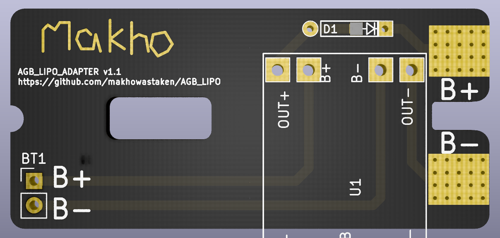
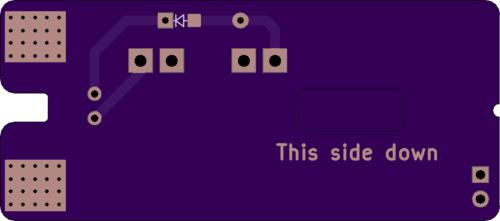

# AGB_LIPO

LiPo adapter for Game Boy Advance. Same concept as my AGS adapters: https://github.com/makhowastaken/AGS_LIPO

Uses these battery terminals: https://il.farnell.com/keystone/5330/battery-contact-aaa-aaaa-n-12v/dp/1888418
a standard TP4056 module (Micro USB or USB C): https://www.aliexpress.com/item/32649780468.html
and pretty much whatever diode you can get your hands on: https://www.aliexpress.com/item/32664545131.html

I've ordered boards and will edit this description when I know they fit and I'll add a youtube video for instruction. 

